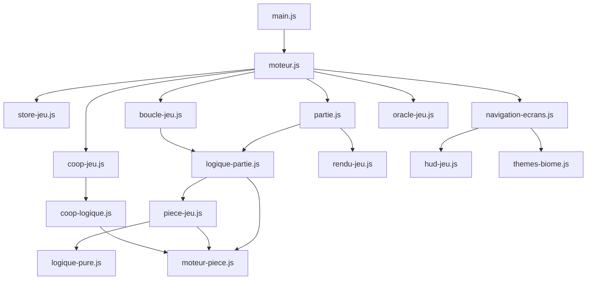

# Architecture Tetris Néo

## Vue d'ensemble

Vanilla ES modules, sans bundler. Point d'entrée : `index.html` → `js/main.js` → `js/moteur.js`.

## Couches

| Couche       | Rôle                         | Fichiers clés                                                                                                   |
| ------------ | ---------------------------- | --------------------------------------------------------------------------------------------------------------- |
| Données      | Constantes, biomes, pièces   | `config-jeu.js`, `biomes.js`, `contenu-jeu.js`, `ecrans-config.js`                                              |
| Logique pure | Fonctions sans DOM           | `logique-pure.js`, `progression.js`, `moteur-piece.js`                                                          |
| État         | Variables partagées          | `store-jeu.js`                                                                                                  |
| Gameplay     | Actions joueur, verrouillage | `logique-partie.js`, `piece-jeu.js`, `boucle-jeu.js`                                                            |
| Coop         | 2 joueurs, plateau partagé   | `coop-logique.js`, `coop-jeu.js`, `coop-rendu.js`, `coop-input.js`                                              |
| Oracle       | Assistant de placement       | `oracle-jeu.js`                                                                                                 |
| Rendu        | Canvas 2D                    | `rendu-jeu.js`, `rendu-plateau.js`, `rendu-fx.js`, `rendu-ambiance.js`, `rendu-previews.js`, `rendu-cellule.js` |
| UI           | Écrans, HUD, thèmes          | `navigation-ecrans.js`, `hud-jeu.js`, `themes-biome.js`                                                         |
| Persistance  | localStorage validé          | `progression.js`                                                                                                |

## Cycle d'une partie

1. `demarrerJeu()` (`partie.js`) initialise le plateau et la file de pièces.
2. `planifierBoucle()` (`boucle-jeu.js`) lance la boucle `requestAnimationFrame`.
3. Chaque frame : gravité, DAS/ARR, lock delay, rendu canvas.
4. `verrouillerPiece()` (`logique-partie.js`) pose la pièce, efface les lignes, met à jour le score.
5. `terminerPartie()` affiche le game over et sauvegarde progression/stats.

## État et actions

- `store-jeu.js` : état centralisé avec getters/setters
- `actions-jeu.js` : injection explicite des callbacks gameplay via `configurerActionsJeu()` dans `moteur.js`
- `ecrans-config.js` : source unique pour les identifiants d'écrans et l'ordre de chargement HTML

## Primitives partagées solo/coop

`moteur-piece.js` centralise l'extraction de formes et la validation de position avec bornes personnalisées. Utilisé par `piece-jeu.js` (solo) et `coop-logique.js` (coop).

## UI modulaire

Les écrans HTML sont chargés depuis `html/*.html` par `charger-ecrans.js` (DOMParser, pas d'innerHTML). Sous-modules UI :

- `navigation-ecrans.js` — navigation entre écrans
- `hud-jeu.js` — score, temps, barre de progression, annonces a11y
- `themes-biome.js` — thèmes visuels et mascotte
- `annonces.js` — zone `aria-live` pour lecteurs d'écran

## Persistance

Toutes les clés `localStorage` passent par `progression.js` avec whitelist stricte.

## PWA

`sw.js` met en cache les assets statiques. La liste est générée par `npm run sync:sw`. Version du cache : `tetris-neo-{semver}`.

## Outillage

| Script              | Rôle                                          |
| ------------------- | --------------------------------------------- |
| `npm test`          | Vitest (unitaires)                            |
| `npm run test:e2e`  | Playwright + Axe                              |
| `npm run sync:sw`   | Synchronise le cache SW dev (modules ES)      |
| `npm run build`     | Bundle esbuild prod → `dist/` (1 fichier JS)  |
| `npm run typecheck` | Vérification TypeScript (`checkJs`) sur `js/` |
| `npm run release`   | Bump version + cache-bust + sync SW           |
