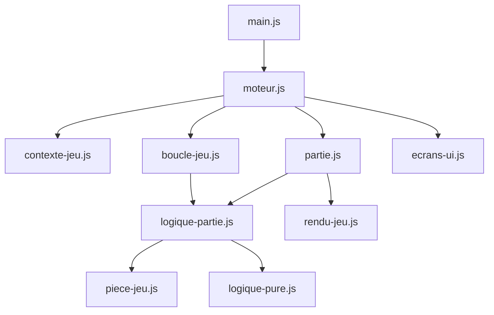

# Architecture Tetris Néo

## Vue d'ensemble

Vanilla ES modules, sans bundler. Point d'entrée : `index.html` → `js/main.js` → `js/moteur.js`.

## Couches

| Couche       | Rôle                         | Fichiers clés                                        |
| ------------ | ---------------------------- | ---------------------------------------------------- |
| Données      | Constantes, biomes, pièces   | `config-jeu.js`, `biomes.js`, `contenu-jeu.js`       |
| Logique pure | Fonctions sans DOM           | `logique-pure.js`, `progression.js`                  |
| État         | Variables partagées          | `contexte-jeu.js`                                    |
| Gameplay     | Actions joueur, verrouillage | `logique-partie.js`, `piece-jeu.js`, `boucle-jeu.js` |
| Rendu        | Canvas 2D                    | `rendu-jeu.js`, `rendu-blocs.js`                     |
| UI           | Écrans, HUD                  | `ecrans-ui.js`, `ui-init.js`, `options-ui.js`        |
| Persistance  | localStorage validé          | `progression.js`                                     |

## Cycle d'une partie

1. `demarrerJeu()` (`partie.js`) initialise le plateau et la file de pièces.
2. `planifierBoucle()` (`boucle-jeu.js`) lance la boucle `requestAnimationFrame`.
3. Chaque frame : gravité, DAS/ARR, lock delay, rendu canvas.
4. `verrouillerPiece()` (`logique-partie.js`) pose la pièce, efface les lignes, met à jour le score.
5. `terminerPartie()` affiche le game over et sauvegarde progression/stats.

## État et actions

- `store-jeu.js` : état centralisé avec getters/setters (`obtenirBiomeActif`, `definirLockDelayRestant`, etc.)
- `contexte-jeu.js` : façade de réexport pour compatibilité
- `actions-jeu.js` : injection explicite des callbacks gameplay via `configurerActionsJeu()` dans `moteur.js`

## UI modulaire

Les écrans HTML sont chargés depuis `html/*.html` par `charger-ecrans.js` avant l'initialisation du moteur.

## Persistance

Toutes les clés `localStorage` passent par `progression.js` (`lireStockage`, `ecrireStockage`, `lireStockageJson`, `ecrireStockageJson`) avec whitelist stricte.

## PWA

`sw.js` met en cache les assets statiques. Version du cache : `tetris-neo-{semver}`.
