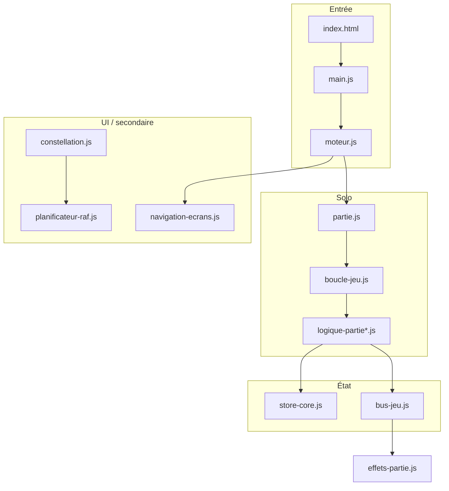

# Architecture

Vanilla ES modules en dev, bundle esbuild en prod.

**Entrée :** `index.html` → `js/main.js` → `js/moteur.js`

## Couches

| Couche      | Fichiers                                                                                |
| ----------- | --------------------------------------------------------------------------------------- |
| Données     | `config-jeu.js`, `biomes.js`, `contenu-jeu.js`, `histoire-textes/`                      |
| Logique     | `logique-pure.js`, `moteur-piece.js`, `score-partie.js`                                 |
| État        | `store-core.js`, `store-jeu.js`, `store-histoire.js`                                    |
| Solo        | `partie.js`, `logique-partie.js`, `boucle-jeu.js`, `piece-jeu.js`                       |
| Coop        | `coop-jeu.js`, `coop-logique.js`                                                        |
| Histoire    | `histoire-manager.js`, `histoire-cutscene*.js`, `boss-jeu.js`, `mecaniques-histoire.js` |
| Rendu / UI  | `rendu-jeu.js`, `navigation-ecrans.js`, `hud-jeu.js`                                    |
| Persistance | `progression.js`                                                                        |

## Organisation des fichiers

- **Sous-dossiers ciblés** — autorisés pour le **contenu** volumineux (`js/histoire-textes/`). Barrel parent (`histoire-textes.js`) + export JSON inchangés.
- **Pas de migration globale** — ne pas déplacer tout `js/histoire/` ou `js/rendu/` d'un coup (diff large, risque de cycles). Découper module par module à la demande.
- **Cutscenes** — responsabilités séparées :
    - `histoire-cutscene.js` — orchestration (séquence, callbacks)
    - `histoire-cutscene-ui.js` — DOM, zones texte, progress
    - `histoire-cutscene-portraits.js` — canvas portraits, boucle RAF
    - `histoire-cutscene-typewriter.js` — effet machine à écrire
    - `histoire-cutscene-nav.js` / `-config.js` / `-fonds.js` — navigation, constantes, arrière-plans

## Règles utiles

1. **Scoring partagé** — `score-partie.js` (`appliquerScoreLignes`) pour solo, coop et archi.
2. **Store** — lectures via `store-jeu.js` ; `store.histoire` via `mode-histoire.js` (`modeHistoireEnCours()` / `activerModeHistoire()` / `desactiverModeHistoire()`) ; `store-core.js` réservé à la couche état (garde-fou `maintainabilite.test.mjs`).
3. **Événements** — `bus-jeu.js` pour découpler logique et effets (`effets-partie.js`).
4. **HTML** — fragments `html/*.html` chargés par `charger-ecrans.js` (pas d'`innerHTML`).
5. **PWA** — cache listé dans `sw-precache.js` (généré), logique dans `sw.js` ; régénéré par `npm run sync:sw`.

## Découpage coop-logique

| Module                      | Rôle                                      |
| --------------------------- | ----------------------------------------- |
| `coop-logique.js`           | Barrel, gravité, init partie, préférences |
| `coop-logique-piece.js`     | Spawn, validation, verrouillage           |
| `coop-logique-mouvement.js` | Déplacements, rotation, hold, passerelle  |

## Partie solo (résumé)

`demarrerJeu()` → boucle RAF → gravité / DAS / lock → `verrouillerPiece()` → `score-partie.js` → rendu.

## Découpage logique-partie

| Module                           | Rôle                             |
| -------------------------------- | -------------------------------- |
| `logique-partie.js`              | Barrel public + `vitesseChute()` |
| `logique-partie-pose.js`         | Flag T-Spin post-rotation        |
| `logique-partie-score.js`        | `calculerScore()`                |
| `logique-partie-hold.js`         | Hold + file pièces               |
| `logique-partie-verrouillage.js` | `verrouillerPiece()`             |
| `logique-partie-mouvement.js`    | Déplacements, rotation, chute    |

## Découpage mecaniques-histoire

| Module                           | Rôle                                        |
| -------------------------------- | ------------------------------------------- |
| `mecaniques-histoire.js`         | Barrel + lifecycle (init, bus, game over)   |
| `mecaniques-histoire-queries.js` | `biomeActuelMecanique()`, états miroir/vide |
| `mecaniques-histoire-rouille.js` | Timestamps, effondrement, décalage matrices |
| `mecaniques-histoire-eclipse.js` | Ligne éclipse, vitesse, libellé HUD         |
| `mecaniques-histoire-vide.js`    | Invisibilité pièce, fantôme, HUD vide       |
| `mecaniques-histoire-trame.js`   | Morph fond trame                            |
| `mecaniques-histoire-miroir.js`  | CSS miroir, inversion actions               |

## Découpage histoire-map-ui

| Module                            | Rôle                                           |
| --------------------------------- | ---------------------------------------------- |
| `histoire-map-ui.js`              | Barrel public (consommé par `histoire-map.js`) |
| `histoire-map-modal-trame.js`     | Overlay conditions Trame                       |
| `histoire-map-interactions.js`    | Pointer, clavier, sélection nœud               |
| `histoire-map-panneau-details.js` | Panneau détail monde                           |
| `histoire-map-entete.js`          | Progression mondes / journaux / trame          |

## Découpage rendu-fond-biome

| Module                           | Rôle                                     |
| -------------------------------- | ---------------------------------------- |
| `rendu-fond-biome.js`            | Lifecycle RAF, couche statique offscreen |
| `rendu-fond-biome-donnees.js`    | Configs 17 biomes + alias                |
| `rendu-fond-biome-particules.js` | Init (`Math.random`) + dessin particules |

## Boucles RAF

- **Principale (partie)** — `boucle-jeu.js` : gravité, DAS, rendu plateau. Suspendue en coop/archi.
- **Secondaires (UI / ambiance)** — `planificateur-raf.js` : constellation, mascotte ROBO, fonds méta (`fond-ecrans-meta.js`). Une clé par contexte (`constellation`, `rendu-robo`, `fond-meta:<canvasId>`).

## Dépendances entre modules

1. **Logique → bus** — pas d'import direct logique → UI/audio (sauf barrels testés).
2. **Store** — lectures via `store-jeu.js` / `store-histoire.js` ; éviter `store-core` hors modules état.
3. **Cycles** — vérifiés par `npm run check:circular` depuis `main.js`.
4. **Barrels** — `logique-partie.js`, `rendu-jeu.js`, `progression.js` : point d'entrée stable pour les consommateurs.
5. **Index modules** — `docs/modules-index.md` (hotspots > 450 L, régénéré par `npm run analyze` ; détail dans `dist/modules-index.json`).

## Gestion des erreurs

- **Handlers globaux** — `main.js` capture `error` et `unhandledrejection` → `logger.js` + bannière `#banniere-erreur`.
- **Journal session** — 10 dernières entrées warn/error en `sessionStorage` ; bouton « Copier rapport » exporte JSON (`formaterRapportErreurs()`).
- **Chargement écrans** — `charger-ecrans.js` : 3 tentatives fetch avec backoff exponentiel avant échec fatal.
- **Boucle de jeu** — `boucle-jeu.js` suspend après 5 erreurs consécutives de rendu.
- **Debug** — `?debug=1` active logs `debug`/`info` et stack traces détaillées.

## Performance

- **RAF conditionnelle** — `aBesoinDeBoucle()` suspend la boucle principale quand inutile.
- **FPS adaptatif** — EWMA dans `boucle-jeu.js` ; effets réduits si FPS < 45 ou `prefers-reduced-motion`.
- **Cache canvas** — gradients statiques (vignette, ambiance bas, masque météo) en offscreen dans `rendu-plateau.js` ; fonds biome/méta pré-générés (`rendu-fond-biome-donnees.js` + couche statique, particules isolées dans `rendu-fond-biome-particules.js`).
- **Budget bundle** — `scripts/verifier-bundle.mjs` en CI (max **560 Ko**, confort 540 Ko ; chunks test exclus via `budget-exclus.json`) ; `npm run analyze` après build.

## Guides

- [Mode Histoire](mode-histoire.md)
- [Ajouter un biome](ajouter-un-biome.md)
- [Ajouter un boss](ajouter-un-boss.md)
- [Ajouter un écran](ajouter-un-ecran.md)
