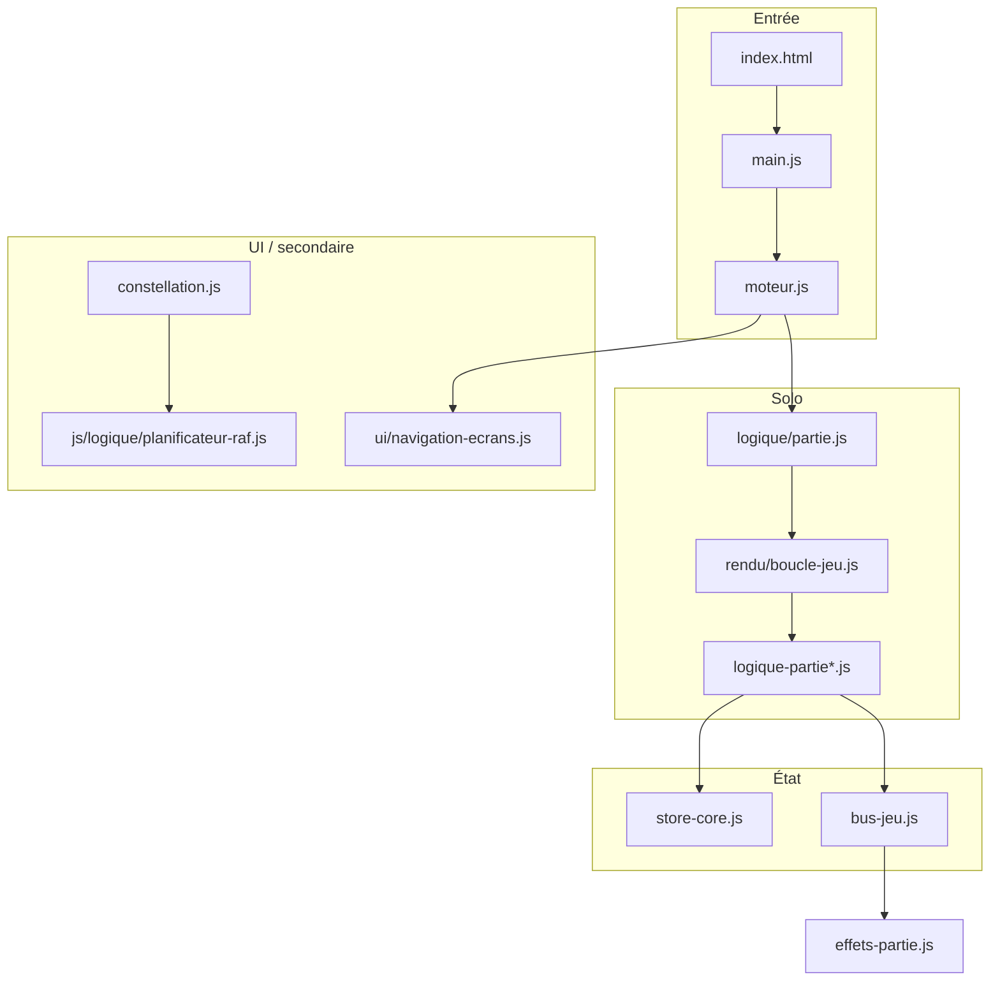

# Architecture

Vanilla ES modules en dev, bundle esbuild en prod.

**Entrée :** `index.html` → `js/main.js` → `js/moteur.js`

Exclusions d’audit volontaires : [`AUDIT-EXCLUSIONS.md`](../AUDIT-EXCLUSIONS.md).

## Couches

| Couche      | Dossiers / exemples                                                                             |
| ----------- | ----------------------------------------------------------------------------------------------- |
| Données     | `config/`, `histoire-textes/`, `contenu-jeu.js`                                                 |
| Logique     | `logique/logique-pure.js`, `logique/moteur-piece.js`, `logique/score-partie.js`                 |
| État        | `etat/store-core.js`, `etat/store-jeu.js`, `etat/mode-histoire.js`                              |
| Solo        | `logique/partie.js`, `logique/logique-partie.js`, `rendu/boucle-jeu.js`, `logique/piece-jeu.js` |
| Coop        | `logique/coop-jeu.js`, `logique/coop-logique.js`                                                |
| Histoire    | `histoire/histoire-manager.js`, `histoire-cutscene*.js`, `boss-jeu.js`                          |
| Rendu / UI  | `rendu/rendu-jeu.js`, `ui/navigation-ecrans.js`, `rendu/hud-jeu.js`                             |
| Persistance | `io/progression.js`                                                                             |

## Organisation des fichiers

- **Domaines par convention** — voir `docs/domaines.md` (préfixes `logique-`, `histoire-`, `rendu-`, etc.).
- **Sous-dossiers ciblés** — autorisés pour le **contenu** volumineux (`js/histoire-textes/`). Barrel parent (`histoire-textes.js`) + export JSON inchangés.
- **Migration par domaines** — dossiers `js/config/`, `js/logique/`, `js/etat/`, etc. (migrations one-shot déjà appliquées). Ne pas déplacer les gros sous-arbres de données (`histoire-textes/`, `*-donnees/`) sans plan dédié.
- **Cutscenes** — responsabilités séparées :
    - `histoire-cutscene.js` — orchestration (séquence, callbacks)
    - `histoire-cutscene-ui.js` — DOM, zones texte, progress
    - `histoire-cutscene-portraits.js` — canvas portraits, boucle RAF
    - `histoire-cutscene-typewriter.js` — effet machine à écrire
    - `histoire-cutscene-nav.js` / `-config.js` / `-fonds.js` — navigation, constantes, arrière-plans

## Règles utiles

1. **Scoring partagé** — `score-partie.js` (`appliquerScoreLignes`) pour solo, coop et archi.
2. **Store** — lectures via `etat/store-jeu.js` ; `store.histoire` via `etat/mode-histoire.js` (`modeHistoireEnCours()` / `activerModeHistoire()` / `desactiverModeHistoire()`) ; `etat/store-core.js` réservé à la couche état (garde-fou `maintainabilite.test.mjs`).
3. **Événements** — `bus-jeu.js` pour découpler logique et effets (`effets-partie.js`).
4. **HTML** — fragments `html/*.html` chargés par `charger-ecrans.js` (pas d'`innerHTML`).
5. **PWA** — cache listé dans `sw-precache.js` (généré), logique dans `sw.js` ; régénéré par `npm run sync:sw`.

## Découpage coop-logique

| Module                      | Rôle                                      |
| --------------------------- | ----------------------------------------- |
| `coop-logique.js`           | Barrel, gravité, init partie, préférences |
| `coop-logique-piece.js`     | Spawn, validation, verrouillage           |
| `coop-logique-mouvement.js` | Déplacements, rotation, hold, passerelle  |

**Rotation coop vs solo** — le coop et le solo utilisent la même table SRS via `tenterRotationSrs()` dans `actions-piece-communes.js` (`coop-logique-mouvement.js` et `logique-partie-mouvement.js`). `tenterRotationSimple` (5 essais horizontaux) existe pour les tests unitaires uniquement.

## Partie solo (résumé)

`demarrerJeu()` → boucle RAF → gravité / DAS / lock → `verrouillerPiece()` → `score-partie.js` → rendu.

## Découpage partie-fin

| Module                         | Rôle                                                               |
| ------------------------------ | ------------------------------------------------------------------ |
| `partie-fin-constantes.js`     | `DELAI_GAME_OVER_MS` (partagé logique/UI)                          |
| `partie-fin.js`                | Orchestration fin solo (records, leaderboard, émet `partie:finie`) |
| `partie-fin-commun.js`         | Stats / codex + bus `partie:finale-commune` (solo+coop)            |
| `ui/partie-fin-effets.js`      | Écoute bus — annonce, profil, audio, haptique, affichage GO        |
| `ui/partie-fin-ecran-go.js`    | Remplissage DOM game-over + actions histoire / Trame               |
| `rendu-fond-biome.js`          | `initialiserFondBiomeBus` — `fond-biome:demarrer` / `arreter`      |
| `etat/particules-spawn.js`     | Spawns particules (logique sans import rendu)                      |
| `coop-rendu.js`                | `initialiserCoopPreviewBus` — `coop:rafraichir-preview`            |
| `partie-rendu-bus.js`          | `partie:rendu-features` / `partie:rendu-ui`                        |
| `effets-visuels-partie.js`     | FX canvas (flash, secousse, textes flottants, previews)            |
| `boucle-jeu.js`                | RAF solo + enregistrement `logique/boucle-controle.js`             |
| `boucle-tick-rendu-bus.js`     | `boucle:tick-rendu` / `timers-effets` / `historique-positions`     |
| `archi-rendu-bus.js`           | `archi:rendu-init` / `rafraichir-preview` / boucle RAF             |
| `coop-boucle-raf.js`           | `coop:rendu-init` / `demarrer-boucle` / `arreter-boucle`           |
| `constellation-boucle.js`      | `constellation:demarrer` / `arreter`                               |
| `ui/boss-ui-hud.js`            | HUD boss DOM (HP, timer, section)                                  |
| `ui/archi-selection-apercu.js` | Aperçus canvas sélection Architecte                                |

## Découpage logique-partie

| Module                           | Rôle                             |
| -------------------------------- | -------------------------------- |
| `logique-partie.js`              | Barrel public + `vitesseChute()` |
| `logique-partie-pose.js`         | Flag T-Spin post-rotation        |
| `logique-partie-score.js`        | `calculerScore()`                |
| `logique-partie-hold.js`         | Hold + file pièces               |
| `logique-partie-verrouillage.js` | `verrouillerPiece()`             |
| `logique-partie-mouvement.js`    | Déplacements, rotation, chute    |

## Découpage mecaniques-histoire

| Module                           | Rôle                                        |
| -------------------------------- | ------------------------------------------- |
| `mecaniques-histoire.js`         | Barrel + lifecycle (init, bus, game over)   |
| `mecaniques-histoire-queries.js` | `biomeActuelMecanique()`, états miroir/vide |
| `mecaniques-histoire-rouille.js` | Timestamps, effondrement, décalage matrices |
| `mecaniques-histoire-eclipse.js` | Ligne éclipse, vitesse, libellé HUD         |
| `mecaniques-histoire-vide.js`    | Invisibilité pièce, fantôme, HUD vide       |
| `mecaniques-histoire-trame.js`   | Morph fond trame                            |
| `mecaniques-histoire-miroir.js`  | CSS miroir, inversion actions               |

## Découpage histoire-map-ui

| Module                            | Rôle                                           |
| --------------------------------- | ---------------------------------------------- |
| `histoire-map-ui.js`              | Barrel public (consommé par `histoire-map.js`) |
| `histoire-map-modal-trame.js`     | Overlay conditions Trame                       |
| `histoire-map-interactions.js`    | Pointer, clavier, sélection nœud               |
| `histoire-map-panneau-details.js` | Panneau détail monde                           |
| `histoire-map-entete.js`          | Progression mondes / journaux / trame          |

## Découpage rendu-fond-biome

| Module                           | Rôle                                     |
| -------------------------------- | ---------------------------------------- |
| `rendu-fond-biome.js`            | Lifecycle RAF, couche statique offscreen |
| `rendu-fond-biome-donnees.js`    | Configs 17 biomes + alias                |
| `rendu-fond-biome-particules.js` | Init (`Math.random`) + dessin particules |

## Boucles RAF

- **Principale (partie)** — `rendu/boucle-jeu.js` : gravité, DAS, rendu plateau. Suspendue en coop/archi.
- **Secondaires (UI / ambiance)** — `js/logique/planificateur-raf.js` : constellation, mascotte ROBO, fonds méta (`fond-ecrans-meta.js`). Une clé par contexte (`constellation`, `rendu-robo`, `fond-meta:<canvasId>`).

## Dépendances entre modules

1. **Logique → bus** — pas d'import direct logique → UI/audio (sauf barrels testés).
2. **Logique → rendu** — interdit (`tests/maintainabilite.test.mjs`, allowlist vide). RAF
   solo : `rendu/boucle-jeu.js` via façade `logique/boucle-controle.js` ; archi/coop/
   constellation/tick FX : bus (`archi:*`, `coop:*`, `constellation:*`, `boucle:tick-*`).
   Spawns : `etat/particules-spawn.js` ; HUD boss : `ui/boss-ui-hud.js` ; aperçu archi :
   `ui/archi-selection-apercu.js` ; init/FX partie : `partie:rendu-*` /
   `effets-visuels-partie.js` ; preview coop : `coop:rafraichir-preview`. Fond biome :
   `fond-biome:*`, `demarrerTransition` dans `store-etat-partie`.
3. **Store** — lectures via `store-jeu.js` / `store-histoire.js` ; éviter `store-core` hors modules état.
4. **Cycles** — vérifiés par `npm run check:circular` depuis `main.js`.
5. **Barrels** — `logique-partie.js`, `rendu-jeu.js`, `progression.js` : point d'entrée stable pour les consommateurs.
6. **Index modules** — `docs/modules-index.md` (hotspots > 450 L, régénéré par `npm run analyze` ; détail dans `dist/modules-index.json`).

## Gestion des erreurs

- **Handlers globaux** — `main.js` capture `error` et `unhandledrejection` → `logger.js` + bannière `#banniere-erreur`.
- **Journal session** — 10 dernières entrées warn/error en `sessionStorage` ; bouton « Copier rapport » exporte JSON (`formaterRapportErreurs()`).
- **Chargement écrans** — `charger-ecrans.js` : 3 tentatives fetch avec backoff exponentiel avant échec fatal.
- **Boucle de jeu** — `rendu/boucle-jeu.js` suspend après 5 erreurs consécutives de rendu.
- **Debug** — `?debug=1` active logs `debug`/`info` et stack traces détaillées.

## Performance

- **RAF conditionnelle** — `aBesoinDeBoucle()` suspend la boucle principale quand inutile.
- **FPS adaptatif** — EWMA dans `rendu/boucle-jeu.js` ; effets réduits si FPS < 45 ou `prefers-reduced-motion`.
- **Cache canvas** — gradients statiques (vignette, ambiance bas, masque météo) en offscreen dans `rendu-plateau.js` ; fonds biome/méta pré-générés (`rendu-fond-biome-donnees.js` + couche statique, particules isolées dans `rendu-fond-biome-particules.js`).
- **Budget bundle** — `scripts/verifier-bundle.mjs` en CI (max **595 Ko**, confort 570 Ko ; chunks test exclus via `budget-exclus.json` ; strip `logger.debug`/`info` via `esbuild-strip-logger.mjs`) ; `npm run analyze` après build.

## Guides

- [Mode Histoire](mode-histoire.md)
- [Ajouter un biome](ajouter-un-biome.md)
- [Ajouter un boss](ajouter-un-boss.md)
- [Ajouter un écran](ajouter-un-ecran.md)
